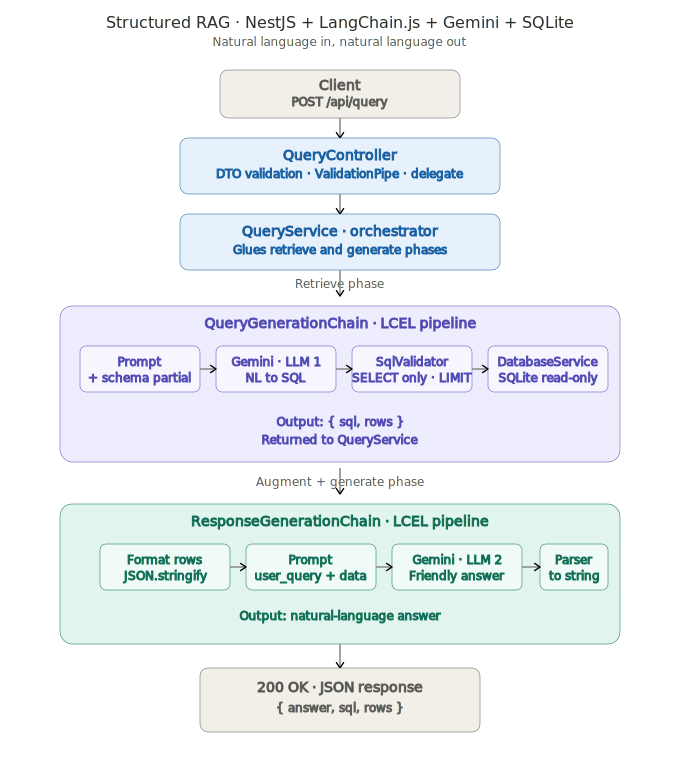

# nl-to-sql

> Natural language to SQL with structured RAG. NestJS + LangChain.js + Gemini + SQLite.

[](https://nodejs.org)
[](https://www.typescriptlang.org)
[](LICENSE)

## What it does

Send a natural-language question over HTTP and get back a natural-language answer grounded in real data. Behind the scenes, the service asks an LLM to translate the question into a SQL query, validates and sanitizes that query, executes it against a SQLite database in read-only mode, and finally asks a second LLM to write a friendly answer from the result rows. The HTTP API exposes a single endpoint: `POST /api/query`.

## Architecture



## Tech stack

- **NestJS 11** (TypeScript, strict mode) — modular framework with first-class DI
- **LangChain.js** — LCEL `RunnableSequence` for chain composition
- **Google Gemini** (`gemini-2.5-flash-lite`) via `@langchain/google-genai`
- **SQLite** via `better-sqlite3` — synchronous native driver, opened in read-only mode
- **class-validator** + **class-transformer** — DTO validation and request sanitization
- **@nestjs/config** — `.env` loading at bootstrap

## How it works

The pipeline is split into two LLM-backed chains, glued together by a thin orchestrator service. The first chain is the **retrieve phase**: a prompt template carries the database schema (extracted once at startup from `sqlite_master` and cached) and the user's question to Gemini. The model returns SQL, which goes through a `SqlValidator` step before reaching the database.

The validator is the trust boundary between the LLM and the database. It strips markdown fences, enforces SELECT-only statements via `^select\b` regex, blocks a denylist of write keywords (`DROP`, `DELETE`, `INSERT`, `UPDATE`, `ALTER`, `CREATE`, `TRUNCATE`, `GRANT`, `REVOKE`) using word-boundary matching, rejects multi-statement payloads, and auto-injects `LIMIT 100` if the model forgot. The validator throws an `UnsafeSqlException` (HTTP 422) on any failure, so unsafe queries never reach `better-sqlite3`.

Even if the validator missed something, the database connection is opened with `{ readonly: true, fileMustExist: true }`. SQLite itself rejects any write attempt at the driver level — that is the second line of defense. This pairing (regex validator + read-only driver) is intentional defense-in-depth.

The second chain is the **augment + generate phase**: the original question and the rows returned by the database are formatted into a fresh prompt, sent to Gemini, and parsed back into a string with `StringOutputParser`. The response prompt explicitly handles the empty-results path so a polite "no matching data" reply is produced when the SQL returns zero rows, instead of leaking an empty array to the user.

Both chains are built with LangChain's LCEL pattern. `RunnableSequence.from([...])` composes the steps (`prompt -> model -> lambda -> validator -> executor`) into a single `Runnable`. Each chain is built lazily on first use and cached on the provider instance, since the schema and prompt structure do not change between requests. The chains compose cleanly because every step implements the same `Runnable<I, O>` interface, the same way Python LangChain pipes them with the `|` operator.

## Quick start

```bash
# 1. Clone the repo
git clone https://github.com/nuri35/nl-to-sql-with-structured-rag-.git
cd nl-to-sql-with-structured-rag-

# 2. Install dependencies
npm install

# 3. Get a Gemini API key from https://aistudio.google.com/app/apikey
#    (free tier is sufficient for development)

# 4. Copy the env example and fill in your key
cp .env.example .env
#    Edit .env, set GOOGLE_API_KEY=AIza...

# 5. Download the Chinook sample database
mkdir -p data
curl -L --fail -o data/chinook.db https://github.com/lerocha/chinook-database/raw/master/ChinookDatabase/DataSources/Chinook_Sqlite.sqlite

# 6. Start the dev server (port 3000)
npm run start:dev

# 7. In another terminal, send a request
curl.exe -X POST http://localhost:3000/api/query -H "Content-Type: application/json" -d '{\"query\": \"How many albums are there?\"}'
```

## Example queries

All examples assume the dev server is running on `localhost:3000` and the Chinook database is in place. Example responses are illustrative — the LLM may phrase answers differently across runs.

### Counting

```bash
curl.exe -X POST http://localhost:3000/api/query -H "Content-Type: application/json" -d '{\"query\": \"How many albums are there?\"}'
```

```json
{
  "answer": "There are **347** albums in total.\n\nDo you have any other questions about the albums?",
  "sql": "SELECT COUNT(*) FROM Album LIMIT 100",
  "rows": [{ "COUNT(*)": 347 }]
}
```

### Aggregation with joins

```bash
curl.exe -X POST http://localhost:3000/api/query -H "Content-Type: application/json" -d '{\"query\": \"Which 3 genres generated the most revenue?\"}'
```

```json
{
  "answer": "The top three genres by revenue are **Rock**, **Latin**, and **Metal**. Want me to break this down by artist next?",
  "sql": "SELECT Genre.Name, SUM(InvoiceLine.UnitPrice * InvoiceLine.Quantity) AS Revenue FROM Genre JOIN Track ON Track.GenreId = Genre.GenreId JOIN InvoiceLine ON InvoiceLine.TrackId = Track.TrackId GROUP BY Genre.Name ORDER BY Revenue DESC LIMIT 3",
  "rows": [
    { "Name": "Rock", "Revenue": 826.65 },
    { "Name": "Latin", "Revenue": 382.14 },
    { "Name": "Metal", "Revenue": 261.36 }
  ]
}
```

### Top-N ranking

```bash
curl.exe -X POST http://localhost:3000/api/query -H "Content-Type: application/json" -d '{\"query\": \"What are the top 5 selling artists?\"}'
```

```json
{
  "answer": "Your bestsellers are **Iron Maiden**, **U2**, **Metallica**, **Led Zeppelin**, and **Deep Purple**. Curious how genres break down across these artists?",
  "sql": "SELECT Artist.Name, COUNT(InvoiceLine.InvoiceLineId) AS Sales FROM Artist JOIN Album ON Album.ArtistId = Artist.ArtistId JOIN Track ON Track.AlbumId = Album.AlbumId JOIN InvoiceLine ON InvoiceLine.TrackId = Track.TrackId GROUP BY Artist.Name ORDER BY Sales DESC LIMIT 5",
  "rows": [
    { "Name": "Iron Maiden", "Sales": 140 },
    { "Name": "U2", "Sales": 107 },
    { "Name": "Metallica", "Sales": 91 },
    { "Name": "Led Zeppelin", "Sales": 87 },
    { "Name": "Deep Purple", "Sales": 82 }
  ]
}
```

### Empty results

```bash
curl.exe -X POST http://localhost:3000/api/query -H "Content-Type: application/json" -d '{\"query\": \"List all customers from Antarctica\"}'
```

```json
{
  "answer": "I couldn't find any customers from Antarctica in the records. Would you like to try a different country?",
  "sql": "SELECT FirstName, LastName, Country FROM Customer WHERE Country = 'Antarctica' LIMIT 100",
  "rows": []
}
```

## Project structure

```
src/
├── main.ts                                       # bootstrap, ValidationPipe, /api global prefix
├── app.module.ts                                 # composition root, ConfigModule.forRoot, validateEnv
├── app.controller.ts                             # default Nest scaffold (kept for now)
├── app.service.ts                                # default Nest scaffold (kept for now)
├── config/
│   └── env.validation.ts                         # fail-fast check for DB_PATH and GOOGLE_API_KEY
├── database/
│   ├── database.module.ts                        # exports DatabaseService
│   ├── database.service.ts                       # better-sqlite3 wrapper, schema cache, read-only
│   └── exceptions/
│       └── database-connection.exception.ts      # HttpException 500
└── query/
    ├── query.module.ts                           # wires controllers, providers, exports
    ├── query.controller.ts                       # POST /api/query, delegates to service
    ├── query.service.ts                          # glues both chains into one pipeline
    ├── chains/
    │   ├── query-generation.chain.ts             # NL -> SQL -> validate -> execute
    │   └── response-generation.chain.ts          # rows -> formatted prompt -> NL answer
    ├── prompts/
    │   ├── query-generation.prompt.ts            # SQLite expert system prompt
    │   └── response-generation.prompt.ts         # friendly database assistant prompt
    ├── llm/
    │   └── llm.provider.ts                       # ChatGoogleGenerativeAI singleton
    ├── validators/
    │   └── sql.validator.ts                      # SELECT-only, denylist, LIMIT injection
    ├── dto/
    │   ├── query-request.dto.ts                  # class-validator + Transform trim
    │   └── query-response.dto.ts                 # response shape interface
    └── exceptions/
        └── unsafe-sql.exception.ts               # HttpException 422
```

## Design decisions

**NestJS over a lighter framework.** DI, modules, and lifecycle hooks pay off as soon as you have more than one feature talking to one another. Provider scoping makes singleton chains and database connections trivial; testability boundaries fall out of module structure for free. A bare Express app would have grown the same wiring by hand.

**Two separate chains instead of one piped chain.** The retrieve and generate phases evolve independently — different prompts, different temperatures (potentially), different observability needs, different failure modes. Splitting them gives clearer naming, easier isolated testing, and the option to swap one phase later (e.g. swap the response chain for a templated formatter) without touching the other.

**`SqlValidator` as a class instead of inline checks.** Single Responsibility lets the validator be exercised on raw strings with no DB or LLM dependencies — every regex and edge case is a one-liner test away. As a domain service it is also easy to extend: adding a new keyword or a new check is purely additive. Inline checks scattered through the chain would have made review and refactor harder.

**Gemini `gemini-2.5-flash-lite`.** Free tier is generous enough for development, latency is low, and SQL generation is well within the model's capability for Chinook-scale schemas. `gemini-2.0-flash` and `gemini-2.0-flash-lite` were tried first but hit a `limit: 0` quota policy on this project's free tier; `gemini-2.5-flash-lite` had a separate quota allocation that worked immediately.

**Read-only SQLite.** The validator is good but not perfect — naive semicolon split mishandles literals with embedded `;`, and a future regex bug could let a forbidden keyword slip through. Opening the connection with `readonly: true` means SQLite itself refuses any write attempt at the driver level. Defense-in-depth: the LLM is treated as untrusted input even after validation.

**Prompt templates in separate files.** Prompts evolve on a different cadence than code. Keeping them as plain `export const` strings makes diffs readable, lets ops tune the prompt without touching chain wiring, and keeps the door open for future prompt-version A/B testing or i18n without mixing concerns.

## Trade-offs and known limitations

- **No retry on invalid SQL.** If the LLM produces SQL that the validator rejects or that SQLite errors on, the request fails. A retry loop with the error fed back into the prompt is a natural next step but adds latency and cost.
- **Synchronous responses only.** The API returns the full `{ answer, sql, rows }` payload after both LLM calls complete. Streaming the answer would improve perceived latency, particularly on the second LLM call, but is not implemented in v1.
- **Hard 100-row LIMIT.** If a question naturally returns many rows, `LIMIT 100` truncates them, sometimes silently. The user has no opt-out short of editing the constant.
- **No automated tests.** Unit and integration tests are deferred to a later iteration. The validator and chains were verified manually with throwaway scripts during development.
- **No evaluation harness.** There is no LangSmith integration or eval suite to track regressions in answer quality across prompt or model changes.
- **SQLite only.** Adding Postgres or MySQL would require a new dialect for the prompt and a different driver — not difficult, but explicitly out of scope for v1.
- **Free-tier rate limits.** The Gemini free tier is fine for a few requests per minute. Production-grade traffic requires a paid tier.

## Roadmap

This project is the first in a series demonstrating RAG architectures on NestJS:

- ✅ **nl-to-sql** (this repo) — Structured RAG with SQL retrieval
- 🔜 **Graph + Vector hybrid RAG** — Entity extraction, Cypher queries, semantic search over Neo4j and embeddings
- 🔜 **Agentic RAG** — Multi-step reasoning, tool use, planning loops

## License

MIT — see [LICENSE](LICENSE).
